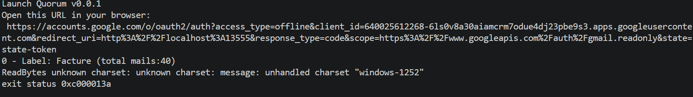
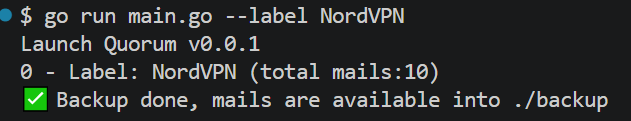
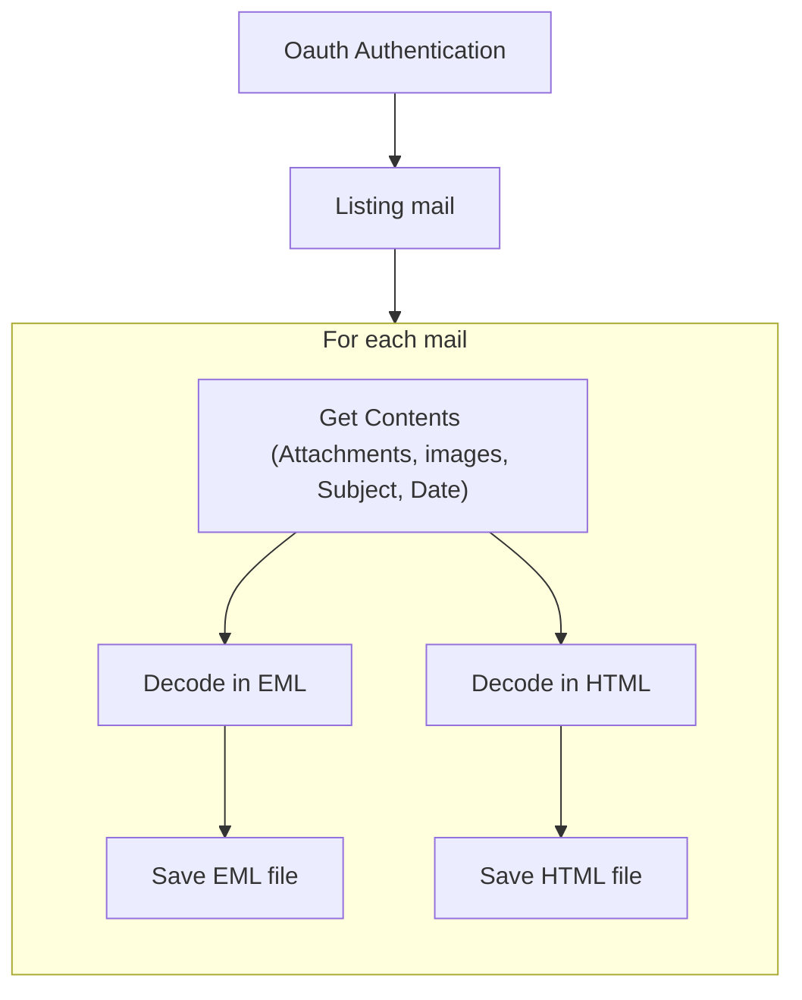

<h1 style="text-align:center;" >
 Quorum
</h1>


[](https://github.com/NY-Daystar/Quorum/actions/workflows/go.yml)

[](https://github.com/NY-Daystar/Quorum/releases)

[](https://github.com/ny-daystar/quorum/releases)
[](https://sourcegraph.com/github.com/NY-Daystar/quorum)

  

  
 

# Summary

- [User Guide](#user-guide)
- [Requirements](#requirements)
- [Get started](#get-started)
- [Explainations](#explainations)
- [Contact](#contact)
- [Credits](#credits)

## User Guide


This application allows to backup your mail from gmail

1. Download `Quorum.exe` project from
   [this link](https://github.com/NY-Daystar/Quorum/releases/download/v0.0.1/Quorum.exe)

1. Then setup your [gmail credentials](#create-credentials)

1. Launch executable

1. It gonna ask you to authorize the app to access on your gmail account
   Like below
   
   Authorize this app: <https://accounts.google.com/>
   🔄 Processus
    1. Click on the link
    1. Log into your gmail account
    1. Click on Authorize

1. At this stage you will get in your folder application this
   gmail-backup/
   │
   ├── Quorum.exe
   ├── config.json
   ├── credentials.json
   ├── token.json
   └── backup/

1. At now the application will backup all your mails into `backup/` folder
   

### Create credentials

1. Go into [Google Cloud Console](https://console.cloud.google.com/)

1. Create a project
   Click on project selector (top of page)
   New Project
   Name : Quorum
1. Activate `Gmail API`
   Menu → APIs & Services → Library
   Search : Gmail API
   Click on `Enable`
1. Configure OAuth consent screen
   Menu → APIs & Services → OAuth consent screen
   Choose Type : `External`
   Fill: App name → ex: Gmail Backup Tool
   Email → your email address

1. Create credentials
   Menu → Credentials
   Click → Create Credentials → OAuth client ID
   Choose Type : `Desktop App`

1. Finally download the json file le JSON
   It looks like

    ```json
    {
        "installed": {
            "client_id": "...",
            "project_id": "...",
            ...
        }
    }
    ```

    Rename the file into `credentials.json` and put it in quorum/credentials.json

1. Don't forget in `Audience section` add a `Test User`

## Requirements

- [.NET Framework](https://dotnet.microsoft.com/en-us/download/dotnet/7.0) >= 7.0
- For developpment: [VS 2022](https://visualstudio.microsoft.com/fr/vs/) >= 2022

## Get started

1. Download `Doppler` project from [this link](https://github.com/NY-Daystar/Doppler/releases/download/v1.7.0/Doppler-portable)

2. Extract zip on your computer

3. Launch `Doppler.exe`
    - The project ask you to choose a folder in your computer to rename files.
    - It will list folder files and submit several renaming.
    - After choosing one the application rename files automatically

# Explainations



## Contact

- To make a pull request: <https://github.com/NY-Daystar/doppler/pulls>
- To summon an issue: <https://github.com/NY-Daystar/doppler/issues>
- For any specific demand by mail: [luc4snoga@gmail.com](mailto:luc4snoga@gmail.com?subject=[GitHub]%doppler%20Project)

## Credits

Made by Lucas Noga.  
Licensed under GPLv3.
